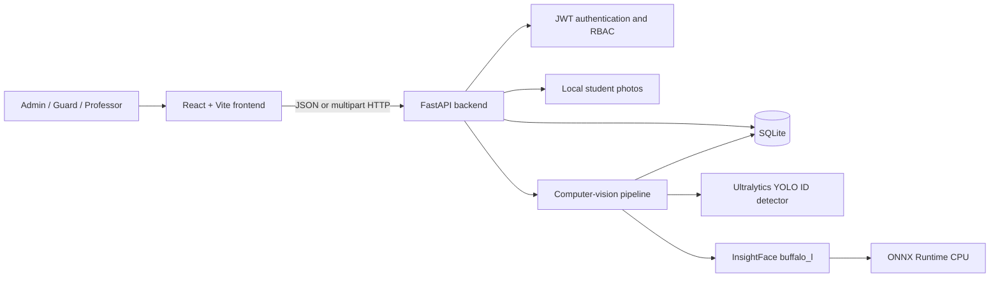
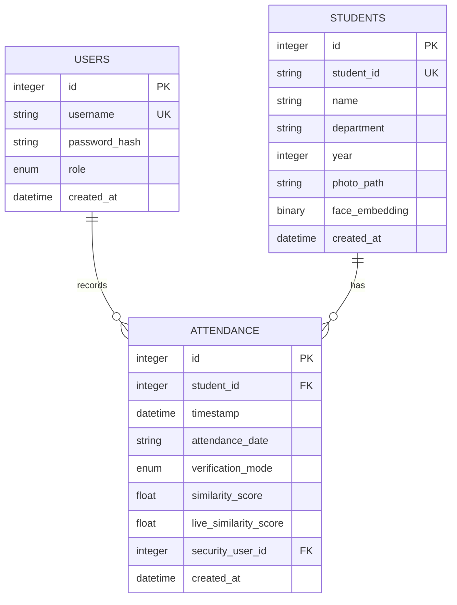
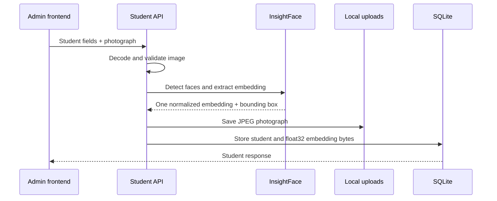
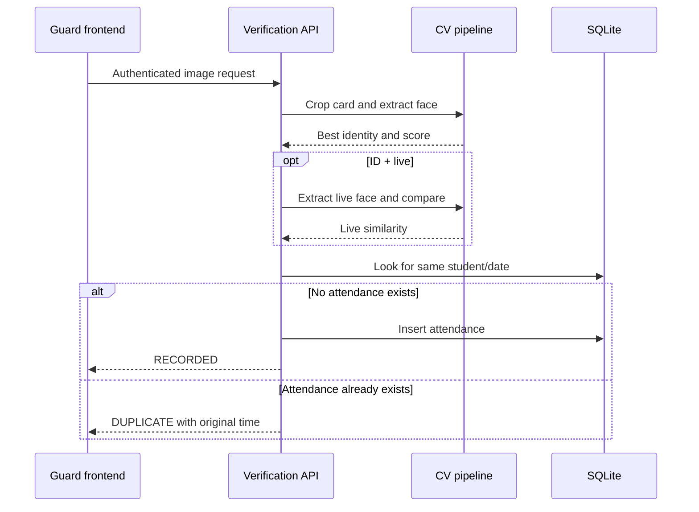

# Smart ID Attendance System — Project Documentation

This document explains the current implementation of Smart ID Attendance in detail. It describes what the application does, how its components work together, how data moves through the system, how roles are enforced, how the computer-vision pipeline identifies students, and how to develop, test, and operate the project locally.

## Table of contents

1. [Purpose and scope](#1-purpose-and-scope)
2. [System architecture](#2-system-architecture)
3. [Technology stack](#3-technology-stack)
4. [Repository structure](#4-repository-structure)
5. [Roles and user flows](#5-roles-and-user-flows)
6. [Authentication and authorization](#6-authentication-and-authorization)
7. [Database design](#7-database-design)
8. [Computer-vision pipeline](#8-computer-vision-pipeline)
9. [Attendance processing](#9-attendance-processing)
10. [Backend API reference](#10-backend-api-reference)
11. [Frontend architecture](#11-frontend-architecture)
12. [Configuration](#12-configuration)
13. [Local development setup](#13-local-development-setup)
14. [Database initialization](#14-database-initialization)
15. [Testing and validation](#15-testing-and-validation)
16. [YOLO detector training](#16-yolo-detector-training)
17. [Security and privacy](#17-security-and-privacy)
18. [Error handling and troubleshooting](#18-error-handling-and-troubleshooting)
19. [Current limitations](#19-current-limitations)
20. [Extension points](#20-extension-points)

## 1. Purpose and scope

Smart ID Attendance is a local university attendance prototype. It identifies a registered student from the face printed on a student ID card and records one attendance entry per student per calendar day. A guard can optionally provide a second, live-face image so the system also verifies that the person presenting the card resembles the registered student.

The application provides three roles:

- **Admin** registers students and manages professor accounts.
- **Guard/Security** scans ID cards and records attendance.
- **Professor** reviews, filters, summarizes, and exports attendance records.

The system runs locally. It does not use cloud face-recognition services, paid APIs, OCR, or QR codes. Face recognition uses InsightFace and an ArcFace-compatible pretrained model through ONNX Runtime.

The application has two verification modes:

- **ID only (`ID_ONLY`)**: identify the face found on the submitted ID-card image.
- **ID + live (`ID_LIVE`)**: identify the ID-card face, then compare a second image against the identified student's stored embedding.

## 2. System architecture

The application consists of a React/Vite frontend, a FastAPI backend, a SQLite database, local image storage, and a computer-vision layer.



The default development addresses are:

| Component | Address |
|---|---|
| Frontend | `http://localhost:5173` |
| Backend API | `http://localhost:8000` |
| Interactive API docs | `http://localhost:8000/docs` |
| Health check | `http://localhost:8000/api/health` |

All persisted application data remains local:

- SQLite data is stored in `backend/smart_attendance.db` by default.
- registered photographs are stored below `backend/uploads/`.
- InsightFace models are stored below `backend/models/insightface/`.
- optional custom YOLO weights are read from `backend/models/id_card.pt` by default.

These runtime artifacts are excluded from Git.

## 3. Technology stack

### Backend

| Technology | Purpose |
|---|---|
| Python 3.11 | Backend runtime |
| FastAPI | HTTP API, request validation, dependency injection, OpenAPI docs |
| Uvicorn | ASGI development server |
| SQLAlchemy 2 | ORM, sessions, queries, table creation |
| SQLite | Default local relational database |
| Pydantic Settings | `.env` configuration loading |
| PyJWT | Signed bearer access tokens |
| Argon2 | Password hashing and verification |
| OpenCV | Image decoding and registered-photo writing |
| NumPy | Embedding representation and cosine similarity |
| InsightFace | Face detection, landmark alignment, and embedding extraction |
| ONNX Runtime | CPU execution for InsightFace models |
| Ultralytics | Optional YOLO ID-card detection and custom model training |

### Frontend

| Technology | Purpose |
|---|---|
| React 18 | Component and state model |
| Vite | Development server and production bundling |
| Lucide React | Interface icons |
| Browser MediaDevices API | Webcam access |
| Browser `localStorage` | Access-token persistence |

## 4. Repository structure

```text
smart-id-attendance-system/
├── backend/
│   ├── app/
│   │   ├── cv/
│   │   │   ├── face_engine.py      # InsightFace adapter and image validation
│   │   │   ├── id_detector.py      # YOLO detector and explicit fallback
│   │   │   └── matcher.py          # Embedding storage and cosine matching
│   │   ├── routers/
│   │   │   ├── admin.py            # User/professor administration
│   │   │   ├── attendance.py       # Lists, summaries, and CSV export
│   │   │   ├── auth.py             # Login and current-user endpoint
│   │   │   ├── students.py         # Student registry
│   │   │   └── verification.py     # ID-only and ID+live verification
│   │   ├── auth.py                 # Passwords, JWTs, and RBAC dependencies
│   │   ├── config.py               # Environment-backed settings
│   │   ├── database.py             # Engine, declarative base, sessions
│   │   ├── evaluation.py           # Threshold metric sweep
│   │   ├── main.py                 # FastAPI application assembly
│   │   ├── models.py               # SQLAlchemy models and enums
│   │   ├── schemas.py              # Pydantic request/response schemas
│   │   └── services.py             # Attendance record service
│   ├── tests/                       # Backend test suite
│   ├── requirements.txt            # Complete dependency set
│   └── .env.example                # Configuration template
├── frontend/
│   ├── src/
│   │   ├── components/
│   │   │   └── WebcamCapture.jsx
│   │   ├── pages/
│   │   │   ├── Admin.jsx
│   │   │   ├── Guard.jsx
│   │   │   ├── Login.jsx
│   │   │   └── Professor.jsx
│   │   ├── App.jsx                 # Session restoration and role routing
│   │   └── api.js                  # Authenticated API wrapper
│   └── package.json
├── scripts/
│   └── seed_database.py            # Development account seeding
├── training/yolo/
│   ├── dataset.yaml
│   ├── train.py
│   └── README.md
└── README.md                        # Setup and project overview
```

## 5. Roles and user flows

### 5.1 Admin

After choosing **Admin** on the entry page and authenticating with an `ADMIN` account, the user reaches the administration dashboard.

The dashboard has two registry tabs:

1. **Students**
   - enter student ID, name, department, and academic year;
   - upload one clear registered photograph;
   - submit the form;
   - the backend detects exactly one face and creates its embedding;
   - the student and local photograph are saved.
2. **Professors**
   - create a professor username and password;
   - view professor accounts;
   - delete professor accounts after confirmation.

Professor creation uses the common `users` table and existing authentication service. It does not create a separate professor authentication system. Passwords are hashed with Argon2 before storage.

### 5.2 Guard/Security

After choosing **Guard**, a `SECURITY` account reaches the scanner dashboard.

The guard can:

- start the browser camera or upload an ID image;
- choose **ID only** or **ID + live face**;
- submit the image or images for verification;
- see the status, identified student, similarity scores, and message;
- see the 20 most recent attendance entries for the current day.

The possible result statuses are:

| Status | Meaning |
|---|---|
| `RECORDED` | Identity passed and a new daily attendance entry was created |
| `DUPLICATE` | Identity passed, but attendance already existed for that day |
| `UNKNOWN` | No registered embedding passed the identification threshold |
| `LIVE_MISMATCH` | The ID matched, but the live image failed the live threshold |
| `ERROR` | The frontend received or generated an error during the request |

### 5.3 Professor

After choosing **Professor**, a `PROFESSOR` account reaches the attendance dashboard.

The professor can:

- view counts for registered, present, absent, and attendance percentage;
- search by student name or student ID;
- filter by exact department;
- filter by start and end dates;
- inspect verification method, ID score, live score, and guard username;
- export the filtered result set as `attendance.csv`.

## 6. Authentication and authorization

### 6.1 Role-enforced login

The login request contains three values:

```json
{
  "username": "professor1",
  "password": "professor123",
  "role": "PROFESSOR"
}
```

The backend performs two separate checks:

1. the username exists and the Argon2 password verifies;
2. the account's stored role equals the role selected on the login page.

A correct password with the wrong selected role returns HTTP `403`. Therefore, an admin cannot authenticate through the professor form and a professor cannot authenticate through the guard form.

### 6.2 Password storage

`backend/app/auth.py` uses `argon2.PasswordHasher`. Plain-text passwords are accepted only during login or account creation. The database stores the Argon2 encoded hash in `users.password_hash`. API response schemas never include the hash.

### 6.3 JWT access tokens

A successful login returns a signed JWT bearer token. Its payload contains:

- `sub`: database user ID;
- `role`: role at token creation time;
- `iat`: issue time;
- `exp`: expiration time.

The default token lifetime is 480 minutes. The frontend stores the token in `localStorage` and adds it to protected requests as:

```http
Authorization: Bearer <token>
```

For every protected request, the backend validates the signature and expiry, reads the user ID from `sub`, and reloads the user from the database. Authorization checks use that current database user. Deleting a professor therefore prevents future authenticated requests even if an old token remains in the browser, because the user record can no longer be loaded.

### 6.4 RBAC matrix

| Capability | Admin | Guard | Professor |
|---|:---:|:---:|:---:|
| Create/list users | Yes | No | No |
| Create/list/delete professors | Yes | No | No |
| Register/delete students | Yes | No | No |
| List students | Yes | No | Yes |
| Verify an ID image | Yes | Yes | No |
| Verify ID + live image | Yes | Yes | No |
| View today's recent attendance | Yes | Yes | No |
| View/filter all attendance | Yes | No | Yes |
| View attendance summary | Yes | No | Yes |
| Export attendance CSV | Yes | No | Yes |

FastAPI dependencies implement this matrix with `require_roles(...)`. Unauthorized authenticated roles receive HTTP `403`; missing, invalid, or expired tokens receive HTTP `401`.

## 7. Database design

The default database is SQLite, accessed with SQLAlchemy 2. The application calls `Base.metadata.create_all()` during backend startup, so missing tables are created automatically. The project currently uses schema creation rather than a migration framework.



### 7.1 `users`

Stores all application accounts, including admins, guards, and professors.

Important constraints:

- `username` is unique and indexed;
- `role` is one of `ADMIN`, `SECURITY`, or `PROFESSOR`;
- only the password hash is stored.

### 7.2 `students`

Stores student identity information and the enrollment embedding.

Important fields:

- `student_id`: unique external/student identifier;
- `photo_path`: relative path below the upload directory;
- `face_embedding`: normalized embedding serialized as raw `float32` bytes.

### 7.3 `attendance`

Stores the attendance evidence and the guard responsible for the record.

The combination of `student_id` and `attendance_date` has a database-level unique constraint. The service also checks for an existing row before insertion. The constraint is the final protection against concurrent duplicate requests.

The recorded evidence includes:

- UTC timestamp;
- calendar date string;
- verification mode;
- ID similarity score;
- optional live similarity score;
- the security/admin user that recorded it.

## 8. Computer-vision pipeline

### 8.1 Student enrollment



Enrollment accepts only a valid image of at least 80×80 pixels. InsightFace must detect exactly one face:

- zero faces produces a user-correctable `422` response;
- multiple faces also produces `422`;
- a valid single face produces a normalized embedding.

The uploaded image is decoded with OpenCV and re-encoded as a local JPEG. The filename contains a sanitized student ID and a short random suffix.

### 8.2 Face engine initialization

`FaceEngine` is a thread-safe lazy singleton. Starting FastAPI does not immediately load the face models. The first enrollment or verification request calls `FaceEngine.instance()`, which initializes:

```python
FaceAnalysis(
    name="buffalo_l",
    root=INSIGHTFACE_MODEL_ROOT,
    providers=["CPUExecutionProvider"],
)
```

It prepares the detector with a 640×640 detection size and `ctx_id=-1` for CPU operation. ONNX Runtime executes the model locally.

InsightFace's `buffalo_l` pack supplies face detection, landmark alignment, and ArcFace-compatible recognition. The implementation reads `normed_embedding`, converts it to `float32`, and normalizes it again defensively.

### 8.3 ID-card crop

Before extracting the ID face, `IdCardDetector` checks whether `YOLO_MODEL_PATH` exists.

If custom weights exist:

1. Ultralytics loads the YOLO model.
2. The model runs with confidence threshold `0.35`.
3. The highest-confidence ID-card box is selected.
4. A 3% padding is added within image bounds.
5. Face analysis runs on the cropped card.

If custom weights do not exist and `ALLOW_MANUAL_ID_FALLBACK=true`, the entire image is treated as an already cropped ID card. The API result explicitly says that the full-image development fallback was used. This fallback still uses the real InsightFace embedding pipeline; it only bypasses automatic card localization.

If weights are absent and fallback is disabled, verification returns an error explaining that detector weights are not configured.

### 8.4 Identification by cosine similarity

For 1:N identification, the backend:

1. loads all registered students;
2. deserializes and normalizes each stored embedding;
3. computes the dot product between normalized vectors, which equals cosine similarity;
4. sorts candidates from highest to lowest score;
5. returns the best student only when the best score meets `FACE_MATCH_THRESHOLD`;
6. includes the second-best score when another candidate exists.

Conceptually:

```text
similarity(query, enrolled) = query · enrolled
accepted = best_similarity >= FACE_MATCH_THRESHOLD
```

The default threshold is `0.45`. It is a starting value for the prototype, not a universal biometric threshold.

### 8.5 Optional live comparison

ID + live mode first performs normal 1:N identification using the ID image. If a student is identified, the backend extracts one embedding from the live image and performs a 1:1 cosine comparison against the student's registered embedding.

Attendance is recorded only if:

```text
live_similarity >= LIVE_FACE_THRESHOLD
```

The default live threshold is also `0.45`.

This is face comparison, not liveness detection. A photograph or replay attack may still pass if it produces a sufficiently similar embedding.

## 9. Attendance processing



`record_attendance()` calculates the current UTC time and derives an ISO date string. It first checks for an existing record for that student and day.

If no record exists, it inserts one and commits. If concurrent requests race, the database unique constraint allows only one insert. The losing request rolls back, reloads the existing row, and returns it as a duplicate instead of producing a second attendance record.

## 10. Backend API reference

All application endpoints use the `/api` prefix. Protected endpoints expect a bearer token.

### 10.1 General and authentication

| Method | Route | Access | Purpose |
|---|---|---|---|
| `GET` | `/api/health` | Public | Return `{"status":"ok"}` |
| `POST` | `/api/auth/login` | Public | Validate username, password, and selected role; return JWT |
| `GET` | `/api/auth/me` | Authenticated | Return the current user |

Login request:

```json
{
  "username": "admin",
  "password": "admin123",
  "role": "ADMIN"
}
```

Successful response:

```json
{
  "access_token": "<signed JWT>",
  "token_type": "bearer"
}
```

### 10.2 User and professor administration

| Method | Route | Access | Purpose |
|---|---|---|---|
| `POST` | `/api/admin/users` | Admin | Create a user with an assigned role |
| `GET` | `/api/admin/users` | Admin | List all users |
| `GET` | `/api/admin/professors` | Admin | List professor accounts |
| `DELETE` | `/api/admin/professors/{user_pk}` | Admin | Delete a professor account |

User creation body:

```json
{
  "username": "newprofessor",
  "password": "a-secure-password",
  "role": "PROFESSOR"
}
```

Usernames must contain 3–80 characters and passwords 8–128 characters. Duplicate usernames return HTTP `409`.

### 10.3 Student registry

| Method | Route | Access | Purpose |
|---|---|---|---|
| `POST` | `/api/students` | Admin | Register student data, photograph, and embedding |
| `GET` | `/api/students` | Admin, Professor | List registered students |
| `DELETE` | `/api/students/{student_pk}` | Admin | Delete a student database record |

Registration uses `multipart/form-data` fields:

| Field | Type | Notes |
|---|---|---|
| `student_id` | text | Unique after whitespace trimming |
| `name` | text | Stored after trimming |
| `department` | text | Stored after trimming |
| `year` | integer | Must be between 1 and 8 |
| `photo` | file | Valid image containing exactly one face |

### 10.4 Verification

| Method | Route | Access | Purpose |
|---|---|---|---|
| `POST` | `/api/verification/id-image` | Guard, Admin | ID-only identification and attendance |
| `POST` | `/api/verification/id-live` | Guard, Admin | ID identification plus live 1:1 comparison |

`id-image` accepts multipart field `image`.

`id-live` accepts multipart fields `id_image` and `live_image`.

A verification response may contain:

```json
{
  "status": "RECORDED",
  "message": "Attendance recorded. Full-image development fallback was used.",
  "student": {
    "id": 1,
    "student_id": "CSE-001",
    "name": "Example Student",
    "department": "CSE",
    "year": 4,
    "photo_url": "/uploads/students/CSE-001_ab12cd34.jpg",
    "created_at": "2026-01-01T00:00:00Z"
  },
  "similarity_score": 0.71,
  "second_best_score": 0.34,
  "live_similarity_score": null,
  "attendance": {}
}
```

### 10.5 Attendance reporting

| Method | Route | Access | Purpose |
|---|---|---|---|
| `GET` | `/api/attendance` | Professor, Admin | Filtered, paginated attendance list |
| `GET` | `/api/attendance/today` | Guard, Admin | Latest 20 records for today |
| `GET` | `/api/attendance/summary` | Professor, Admin | Registered/present/absent summary |
| `GET` | `/api/attendance/export` | Professor, Admin | Filtered CSV download |

List and export filters:

| Parameter | Meaning |
|---|---|
| `search` | Case-insensitive partial student name or ID |
| `department` | Exact department match |
| `start_date` | Inclusive ISO date |
| `end_date` | Inclusive ISO date |
| `offset` | List endpoint offset, default `0` |
| `limit` | List endpoint page size, default `100`, maximum `500` |

The summary endpoint also accepts an optional `day` query parameter. The frontend currently requests the default current day.

## 11. Frontend architecture

### 11.1 Session and role routing

`App.jsx` owns the authenticated user state. On startup it checks `localStorage` for a token and requests `/api/auth/me`.

- A valid token restores the session.
- A failed request removes the token.
- No authenticated user renders the login page.
- An authenticated role selects exactly one dashboard component.

There is no client-side route library. Dashboard selection is based directly on `user.role`:

```text
SECURITY  → Guard dashboard
PROFESSOR → Professor dashboard
ADMIN     → Admin dashboard
```

The backend remains the authority; hiding frontend controls is not relied upon for security.

### 11.2 API wrapper

`frontend/src/api.js` defines the API base URL and shared request behavior:

- default API URL: `http://localhost:8000/api`;
- override: Vite environment variable `VITE_API_URL`;
- adds bearer token when present;
- adds JSON content type for non-`FormData` request bodies;
- parses FastAPI error details into user-readable messages;
- handles HTTP `204` without attempting JSON parsing.

### 11.3 Camera capture

`WebcamCapture.jsx` requests an environment-facing camera at an ideal width of 1280 pixels. A capture draws the current video frame onto a canvas and returns a JPEG blob at quality `0.92`.

Camera tracks are stopped when the component unmounts. If browser permission is unavailable, the UI tells the guard to upload an image instead.

Camera access generally requires `localhost` or HTTPS because browsers restrict `getUserMedia()` on insecure remote origins.

## 12. Configuration

Backend settings are read from `backend/.env` through Pydantic Settings. Copy `.env.example` when preparing a new checkout.

| Variable | Default/example | Purpose |
|---|---|---|
| `DATABASE_URL` | `sqlite:///./smart_attendance.db` | SQLAlchemy database URL |
| `JWT_SECRET` | placeholder | JWT signing secret; replace outside local demo use |
| `FACE_MATCH_THRESHOLD` | `0.45` | Minimum 1:N ID similarity |
| `LIVE_FACE_THRESHOLD` | `0.45` | Minimum 1:1 live similarity |
| `INSIGHTFACE_MODEL_ROOT` | `models/insightface` | InsightFace root directory |
| `YOLO_MODEL_PATH` | `models/id_card.pt` | Optional trained card-detector weights |
| `UPLOAD_DIRECTORY` | `uploads` | Local registered-photo directory |
| `ALLOW_MANUAL_ID_FALLBACK` | `true` | Treat full image as an already cropped card when YOLO weights are missing |
| `CORS_ORIGINS` | `http://localhost:5173` | Comma-separated permitted frontend origins |

Other backend defaults in `config.py` include:

- JWT algorithm: `HS256`;
- access-token lifetime: 480 minutes;
- application name: `Smart ID Attendance`.

Relative paths are resolved from the backend process's working directory. Run backend commands from `backend/` unless the path configuration is made absolute.

## 13. Local development setup

### 13.1 Linux backend

Requirements:

- Python 3.11;
- a C/C++ build toolchain if a dependency must compile locally;
- enough disk space for Python packages and InsightFace models;
- internet access for the initial dependency and model download.

From the repository root:

```bash
cd backend
python3.11 -m venv .venv
source .venv/bin/activate
python -m pip install --upgrade pip
```

Install CPU-only PyTorch first. This prevents Ultralytics dependency resolution from choosing a much larger CUDA build on a machine that will run CPU inference:

```bash
python -m pip install "torch==2.5.1+cpu" "torchvision==0.20.1+cpu" \
  --index-url https://download.pytorch.org/whl/cpu
python -m pip install -r requirements.txt
```

Create configuration and seed the database:

```bash
cp .env.example .env
python ../scripts/seed_database.py
```

Start FastAPI:

```bash
uvicorn app.main:app --reload --host 127.0.0.1 --port 8000
```

### 13.2 Frontend

Use Node.js 20 or newer:

```bash
cd frontend
npm install
npm run dev
```

Open `http://localhost:5173`.

### 13.3 Windows backend

The original Windows workflow remains supported:

```powershell
cd backend
py -3.11 -m venv .venv
.venv\Scripts\Activate.ps1
pip install -r requirements.txt
Copy-Item .env.example .env
python ../scripts/seed_database.py
uvicorn app.main:app --reload
```

InsightFace may need Visual Studio C++ Build Tools and a Windows SDK if no compatible wheel is available. The full face-recognition application requires `requirements.txt`.

## 14. Database initialization

Run the seed script from `backend/`:

```bash
.venv/bin/python ../scripts/seed_database.py
```

The script creates or updates these development-only accounts:

| Role | Username | Password |
|---|---|---|
| Admin | `admin` | `admin123` |
| Guard | `guard1` | `guard123` |
| Professor | `professor1` | `professor123` |

Running the seed script again is idempotent for these usernames, but it resets their roles and passwords to the development values. Change the credentials before allowing access outside a private demonstration environment.

## 15. Testing and validation

### 15.1 Backend tests

```bash
cd backend
.venv/bin/python -m pytest -q
```

The current automated suite verifies:

- successful login and `/auth/me`;
- denial of an unauthorized admin endpoint;
- rejection when the selected login role does not match the account;
- professor creation, listing, deletion, and failed login after deletion;
- prevention of duplicate daily attendance;
- selection of the best cosine match;
- rejection below the configured similarity threshold.

The test suite uses `backend/test_smart_attendance.db`, drops and recreates tables around each test, and seeds a test admin.

### 15.2 Frontend production build

```bash
cd frontend
npm run build
```

The build output is written to `frontend/dist/`, which is Git-ignored.

### 15.3 CV smoke-test expectations

A meaningful CV smoke test must go beyond importing packages. It should verify that:

1. OpenCV decodes a real image;
2. ONNX Runtime exposes `CPUExecutionProvider`;
3. `FaceAnalysis(name="buffalo_l")` initializes;
4. the model detects a face in a real image;
5. `normed_embedding` is present;
6. the embedding is finite, normalized, and normally has 512 dimensions.

Application-level enrollment already exercises these operations and rejects images without exactly one face.

### 15.4 Threshold evaluation

`backend/app/evaluation.py` evaluates labeled cosine scores across a threshold range. Prepare a CSV:

```csv
score,label
0.72,1
0.31,0
```

`label=1` means the pair is the same identity; `label=0` means different identities.

Run:

```bash
cd backend
.venv/bin/python -m app.evaluation pairs.csv \
  --start 0.1 --stop 0.8 --step 0.01 > metrics.csv
```

The output contains accuracy, precision, recall, false-accept rate, false-reject rate, true-positive rate, and false-positive rate for each threshold.

## 16. YOLO detector training

Custom ID-card detection is optional but required for reliable localization when the card does not fill the input image.

Prepare this structure under `training/yolo/`:

```text
dataset/
├── images/
│   ├── train/
│   ├── val/
│   └── test/
└── labels/
    ├── train/
    ├── val/
    └── test/
```

Each label uses YOLO format:

```text
0 x_center y_center width height
```

Coordinates are normalized from 0 to 1. Use consented images with varied rotation, distance, lighting, glare, and partial occlusion. Redact unrelated personal information.

From the activated backend environment:

```bash
python ../training/yolo/train.py
```

The script starts from `yolo11n.pt`, trains for 80 epochs at image size 640 and batch size 16, and validates the resulting model. Copy the best weights to:

```text
backend/models/id_card.pt
```

or change `YOLO_MODEL_PATH`.

## 17. Security and privacy

### Implemented controls

- Argon2 password hashing;
- signed, expiring JWTs;
- server-side role enforcement on every protected endpoint;
- selected-role enforcement during login;
- unique usernames and student identifiers;
- database-level duplicate attendance protection;
- explicit CORS allowlist;
- image validation and exactly-one-face enrollment rule;
- secrets, databases, uploads, models, and local environments excluded from Git;
- generic HTTP `500` response while detailed unexpected errors remain in server logs.

### Operational requirements

- replace `JWT_SECRET` with a long random value;
- change development account passwords;
- restrict filesystem access to the database, model, and upload directories;
- obtain informed consent before collecting face images;
- define retention and deletion procedures;
- back up the database and uploads together if backups are required;
- use HTTPS and a hardened deployment server before network exposure;
- validate thresholds with data representative of the real capture conditions and population;
- review InsightFace model licensing for the intended use.

Biometric embeddings and photographs are sensitive personal data. Local execution reduces external disclosure but does not remove the need for access controls, retention limits, audit procedures, and compliance with applicable law or university policy.

## 18. Error handling and troubleshooting

### `InsightFace models are unavailable`

Confirm that the full requirements are installed inside `backend/.venv`, ONNX Runtime imports, and the model exists below:

```text
backend/models/insightface/models/buffalo_l/
```

The outer location is controlled by `INSIGHTFACE_MODEL_ROOT`.

### Pip tries to download large CUDA packages

Install the CPU PyTorch and torchvision wheels before `requirements.txt`, using the PyTorch CPU index shown in the Linux setup section.

### `No face was detected`

Use a clear, front-facing image with adequate light. Ensure the printed face is large enough after any ID-card crop.

### `Multiple faces were detected`

Enrollment intentionally accepts exactly one face. Crop the image so only the student's registered face is visible.

### `No ID card was detected`

This occurs when custom YOLO weights are loaded but no box passes inference. Improve the capture, inspect detector training quality, or use an already cropped card with the documented development fallback.

### Full-image fallback message appears

This is expected while `YOLO_MODEL_PATH` does not exist and `ALLOW_MANUAL_ID_FALLBACK=true`. Supply trained detector weights for wide-scene card localization.

### Frontend reports `Failed to fetch`

Check that:

- FastAPI is running on port 8000;
- the frontend API URL is correct;
- `CORS_ORIGINS` contains the exact frontend origin, including hostname and port;
- `localhost` and `127.0.0.1` are not being mixed when only one is allowed.

### Camera does not start

Grant camera permission, use `http://localhost:5173`, and verify that no other program holds the camera. Image upload remains available when camera access fails.

### Login returns `403`

Choose the role that matches the account. Valid credentials submitted through another role form are deliberately rejected.

### Login returns `401`

The username/password is incorrect, the token is invalid or expired, or the corresponding user was deleted.

## 19. Current limitations

- The project is a local classroom prototype, not a production identity platform.
- 1:N matching loads all students and performs a linear scan, which suits a small registry but not a large deployment.
- The repository does not include trained ID-card detector weights.
- The full-image fallback assumes the uploaded image is already tightly cropped around the card.
- ID + live verifies facial similarity but does not implement liveness or anti-spoofing.
- Similarity thresholds require local calibration and fairness evaluation.
- Tables are created with `create_all`; schema migrations are not implemented.
- Account password reset, account deactivation, and audit logs are not implemented.
- Student deletion removes the database row but the current route does not explicitly remove the stored photograph.
- Formal course, class session, enrollment, timetable, and per-subject attendance models are not implemented.
- Attendance uniqueness is per student and calendar day, not per course session.
- Dates are derived from application/server time; timezone administration is not exposed in the UI.
- The frontend stores the JWT in `localStorage`; a hardened network deployment should review session storage and XSS protections.
- SQLite and local file storage are appropriate for a local prototype but require a different operational design for concurrent multi-server deployment.

## 20. Extension points

The current architecture can be extended without replacing the CV pipeline:

- add Alembic migrations before evolving the database schema;
- add guard account management alongside professor management;
- add courses, sections, class sessions, and professor assignments;
- associate attendance uniqueness with a class session instead of a day;
- add account deactivation and password-change workflows;
- add audit events for administrative and verification actions;
- paginate professor-facing tables in the UI using the existing API offset and limit parameters;
- introduce a vector index only when registry size justifies it;
- add calibrated ambiguity handling using the best/second-best score margin;
- add a dedicated liveness model for anti-spoofing;
- add managed deletion of student photos and attendance according to a retention policy;
- add a production frontend/API deployment configuration while keeping inference local.

Any extension that changes biometric processing should preserve the current separation between card detection, face extraction, matching, and attendance recording. This makes each part independently testable and keeps authorization outside the CV layer.
